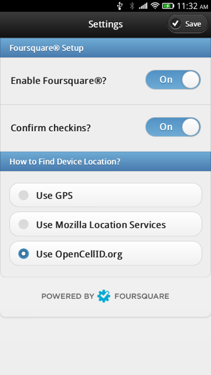

Checkin
=======

This is an open web app, targetted at Firefox OS and tested initially on the Geeksphone Peak, that enables simple checking to nearby locations on Foursquare.

It does not attempt to be a complete Foursquare application: you can't enter new venues, you can't "explore" or see where your friends are. You can checkin. That's it.

I wrote it for two reasons: I wanted to be able to simply and easily checkin from my Firefox OS phone, and I wanted to learn more, and document for others, how to do OAuth2 authentication via JavaScript, without needing any server proxies or other shims.

How to Install
--------------

To install from Firefox Marketplace:

* [https://marketplace.firefox.com/app/checkin](https://marketplace.firefox.com/app/checkin)

The Marketplace version is out of date because Firefox OS only allows "certified" apps permission to obtain the data necessary to establish location from Mozilla Location Services, and regular everyday people like me can't submit certified apps to the Marketplace.

To install from source, which doesn't have these limitations:

1. Connect your device via USB to a computer running Firefox and the [Firefox OS Simulator](https://addons.mozilla.org/en-US/firefox/addon/firefox-os-simulator/) or [Firefox App Manager](https://developer.mozilla.org/en-US/Firefox_OS/Using_the_App_Manager)
2. Clone the repository to your local machine.
3. From the Firefox OS Simulator or App Manager, push the app to your device.

How to Configure
----------------

On first run the "Settings" screen will open. Switch "Enable Foursquare" to "On" and (as long as you're online somehow) you'll be prompted to authenticate to Foursquare and give the app permission to communicate to Foursquare on your behalf. 

You also have the option of having the app asking you for confirmation of each checkin (which prevents accidental checkins if your device is extra-sensitive to touch).

Under "How to Find Device Location?" select either "Use GPS" (which is more accurate, but as the GPS can take time to establish a lock, can be slower) or "Use Mozilla Location Services" (which is less accurate, may have poor coverage for your area, but can be much faster than GPS).

When you return to the main screen, the app will establish your location and you'll be shown a list of nearby Foursquare venues; to checkin, just tap a venue, and optionally confirm your checkin. *That's it*.

To Do
-----

* Handle failure of Foursquare authorization or updates more elegantly (or, indeed, at all).
* Allow creating new venues (that's about the only new feature I want to add).

Sources and Credits
-------------------

* [jQuery](http://jquery.com/)
* [jQuery Mobile](http://jquerymobile.com/)
* [Olle Jonsson](http://ollehost.dk/blog/) provided Swedish and Danish localizations.
* [Peter Bihr](http://www.thewavingcat.com/) provided German localization.
* [Pedro Custódio](http://www.pedrocustodio.com/) provided Portuguese localization.
* [Mikko Pervilä](http://www.cs.helsinki.fi/u/pervila/) provided Finnish localization.

Screenshots
-----------

