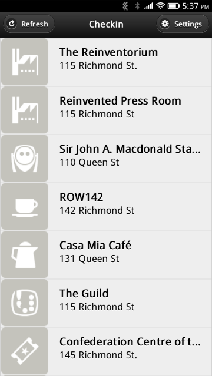

Checkin
=======

This is an open web app, targetted at Firefox OS and tested initially on the Geeksphone Peak, that enables simple checking to nearby locations on Foursquare.

It does not attempt to be a complete Foursquare application: you can't enter new venues, you can't "explore" or see where your friends are. You can checkin. That's it.

I wrote it for two reasons: I wanted to be able to simply and easily checkin from my Firefox OS phone, and I wanted to learn more, and document for others, how to do OAuth2 authentication via JavaScript, without needing any server proxies or other shims.

How to Install
--------------

To install from Firefox Marketplace (version may not be up-to-date):

* [https://marketplace.firefox.com/app/checkin](https://marketplace.firefox.com/app/checkin)

To install from source:

1. Connect your device via USB to a computer running Firefox and the [Firefox OS Simulator](https://addons.mozilla.org/en-US/firefox/addon/firefox-os-simulator/).
2. Clone the repository to your local machine.
3. From the [Firefox OS Simulator](https://addons.mozilla.org/en-US/firefox/addon/firefox-os-simulator/), click **Add Directory** and locate the manifest.webapp you just cloned.
4. Push the app to your device ([more details here](https://marketplace.firefox.com/developers/docs/firefox_os_simulator)).

How to Configure
----------------

On first run the "Settings" screen will open. Check the "Enable Foursquare" checkbox and (as long as you're online somehow) you'll be prompted to authenticate to Foursquare and give the app permission to communicate to Foursquare on your behalf.

When you return to the main screen, the app will fire up your GPS, and wait to establish your position; once it's done this, you'll be shown a list of nearby Foursquare venues; to checkin, just tap a venue. *That's it*.

To Do
-----

* Handle failure of Foursquare authorization or updates more elegantly (or, indeed, at all).
* Allow creating new venues (that's about the only new feature I want to add).

Sources
-------

* [Zepto.js](http://zeptojs.com/)

Screenshots
-----------

